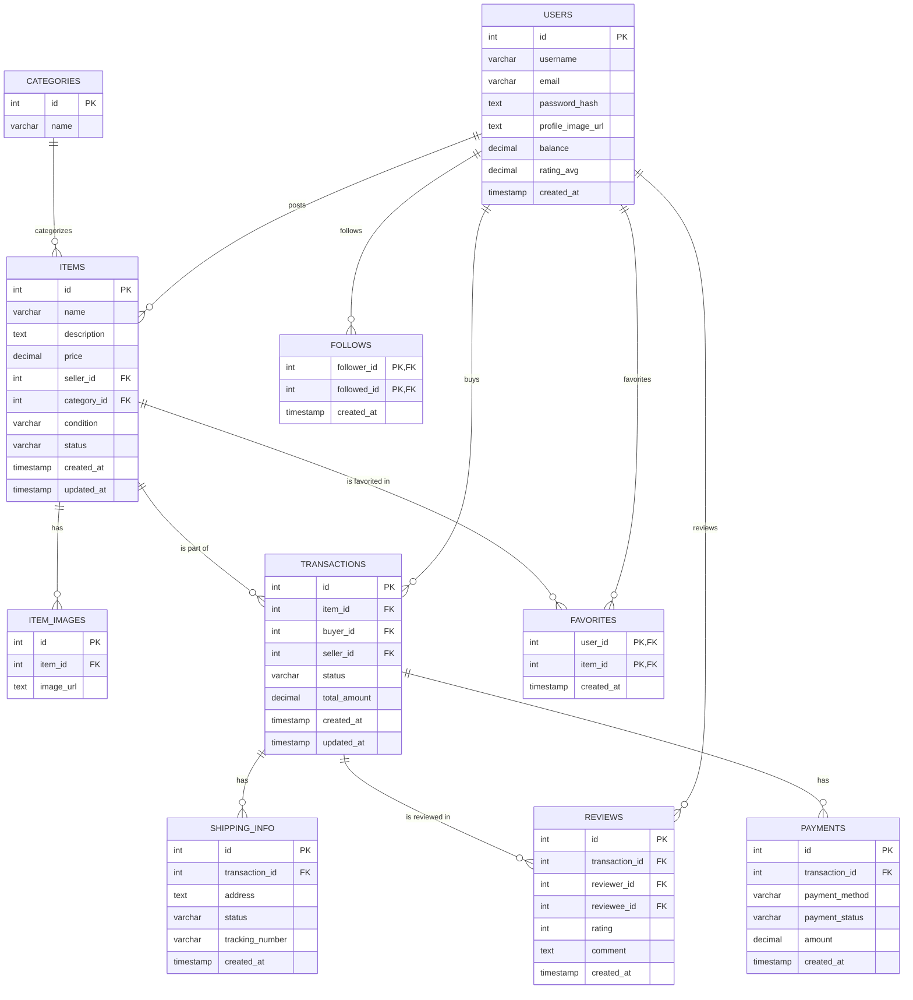

```mermaid
erDiagram
    USERS {
        int id PK
        varchar username
        varchar email
        text password_hash
        text profile_image_url
        decimal balance
        decimal rating_avg
        timestamp created_at
    }
    
    ITEMS {
        int id PK
        varchar name
        text description
        decimal price
        int seller_id FK
        int category_id FK
        varchar condition
        varchar status
        timestamp created_at
        timestamp updated_at
    }
    
    CATEGORIES {
        int id PK
        varchar name
    }
    
    ITEM_IMAGES {
        int id PK
        int item_id FK
        text image_url
    }
    
    TRANSACTIONS {
        int id PK
        int item_id FK
        int buyer_id FK
        int seller_id FK
        varchar status
        decimal total_amount
        timestamp created_at
        timestamp updated_at
    }
    
    SHIPPING_INFO {
        int id PK
        int transaction_id FK
        text address
        varchar status
        varchar tracking_number
        timestamp created_at
    }
    
    PAYMENTS {
        int id PK
        int transaction_id FK
        varchar payment_method
        varchar payment_status
        decimal amount
        timestamp created_at
    }
    
    REVIEWS {
        int id PK
        int transaction_id FK
        int reviewer_id FK
        int reviewee_id FK
        int rating
        text comment
        timestamp created_at
    }
    
    FOLLOWS {
        int follower_id PK, FK
        int followed_id PK, FK
        timestamp created_at
    }
    
    FAVORITES {
        int user_id PK, FK
        int item_id PK, FK
        timestamp created_at
    }
    
    USERS ||--o{ ITEMS : "posts"
    USERS ||--o{ TRANSACTIONS : "buys"
    USERS ||--o{ REVIEWS : "reviews"
    USERS ||--o{ FOLLOWS : "follows"
    USERS ||--o{ FAVORITES : "favorites"
    
    ITEMS ||--o{ ITEM_IMAGES : "has"
    ITEMS ||--o{ TRANSACTIONS : "is part of"
    ITEMS ||--o{ FAVORITES : "is favorited in"
    CATEGORIES ||--o{ ITEMS : "categorizes"
    
    TRANSACTIONS ||--o{ SHIPPING_INFO : "has"
    TRANSACTIONS ||--o{ PAYMENTS : "has"
    TRANSACTIONS ||--o{ REVIEWS : "is reviewed in"
```